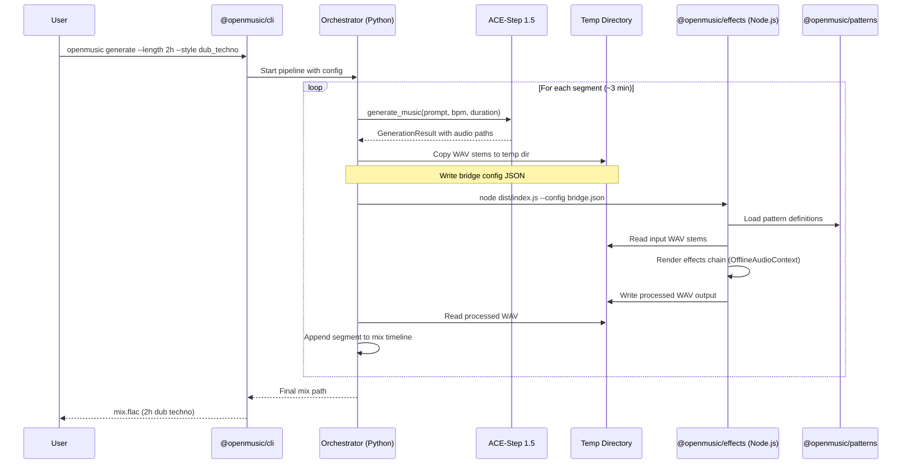

# System Architecture

## Overview

OpenMusic is a multi-language framework for AI-powered dub techno generation. It combines ACE-Step 1.5 (AI music generation), `web-audio-api` (offline audio effects rendering), and Strudel-inspired pattern sequencing into a single CLI-driven workflow.

**Python is the orchestrator.** It manages the generation pipeline, calls ACE-Step for AI stem creation, and delegates effects processing to Node.js via a file-based bridge.

### Target

2-hour dub techno mixes at 125 BPM in minor keys, rendered on consumer hardware (RTX 2060 6GB).

---

## Component Diagram

```mermaid
graph TB
    subgraph "User Layer"
        CLI["@openmusic/cli<br/>TypeScript"]
    end

    subgraph "Orchestration Layer"
        CORE["openmusic-core<br/>Python"]
        ORCH["Orchestrator<br/>Python"]
    end

    subgraph "Generation Layer"
        ACESTEP["ACE-Step 1.5<br/>Python (DiT-only)"]
    end

    subgraph "Processing Layer"
        EFFECTS["@openmusic/effects<br/>TypeScript · web-audio-api"]
        PATTERNS["@openmusic/patterns<br/>TypeScript · Strudel patterns"]
    end

    subgraph "Bridge"
        TMPDIR["Temp Directory<br/>WAV files + JSON config"]
    end

    CLI -->|CLI args| CORE
    CORE -->|pipeline commands| ORCH
    ORCH -->|generate_music()| ACESTEP
    ACESTEP -->|WAV stems| TMPDIR
    ORCH -->|JSON config| TMPDIR
    TMPDIR -->|config + stems| EFFECTS
    PATTERNS -->|pattern data| EFFECTS
    EFFECTS -->|processed WAV| TMPDIR
    TMPDIR -->|result WAV| ORCH
    ORCH -->|final mix| CLI
```

---

## Data Flow



### Segment Strategy

ACE-Step generates 3-minute segments (practical duration limit for quality). The orchestrator loops to produce a 2-hour mix:

- ~40 segments for a 2-hour mix
- Each segment: prompt generation → AI render → effects processing → crossfade
- Segments overlap with crossfade (configurable, default 4 beats = ~1.92s at 125 BPM)

---

## Bridge Mechanism

The bridge connects Python (orchestrator) and TypeScript (effects engine) using **temp files + JSON config**. This is deliberately simple — no IPC, no WebSocket, no shared memory.

### Why File-Based?

- **Simple to debug**: Inspect WAV files and JSON config at any point
- **Language-agnostic**: No tight coupling between Python and Node.js
- **Resumable**: Failed steps can be retried from the last successful file write
- **No version skew**: Python and Node.js can be updated independently

### Flow

```
1. Python writes WAV stems to:     /tmp/openmusic-{uuid}/input/
2. Python writes config JSON to:   /tmp/openmusic-{uuid}/config.json
3. Python spawns:                  node packages/effects/dist/index.js --config /tmp/openmusic-{uuid}/config.json
4. Node.js reads config + stems
5. Node.js processes through effects chain (OfflineAudioContext)
6. Node.js writes output WAV to:   /tmp/openmusic-{uuid}/output/processed.wav
7. Node.js exits with code 0 (success) or non-zero (failure)
8. Python reads output WAV, cleans up temp dir
```

### Temp Directory Layout

```
/tmp/openmusic-{uuid}/
├── config.json           # Bridge config (see JSON Config Format below)
├── input/
│   ├── stem_0.wav        # AI-generated stem (bass, pads, percussion, etc.)
│   ├── stem_1.wav
│   └── ...
└── output/
    └── processed.wav     # Effects-processed result
```

### Cleanup

Temp directories are cleaned up after successful processing. On failure, temp dirs are preserved for debugging (configurable via `--keep-temp` flag).

---

## JSON Config Format

Passed from Python orchestrator to Node.js effects engine:

```jsonc
{
  // Audio parameters
  "sampleRate": 48000,
  "channels": 2,
  "duration": 180.0,

  // Musical context
  "bpm": 125,
  "key": "Am",
  "timeSignature": [4, 4],

  // Input stems (relative to config file location)
  "inputStems": [
    { "path": "input/stem_0.wav", "role": "bass" },
    { "path": "input/stem_1.wav", "role": "pads" },
    { "path": "input/stem_2.wav", "role": "percussion" }
  ],

  // Output
  "outputPath": "output/processed.wav",

  // Effects chain configuration
  "effects": {
    "filter": {
      "type": "lowpass",
      "frequency": 800,
      "Q": 2.0
    },
    "delay": {
      "delayTime": 0.375,
      "feedback": 0.35,
      "wetLevel": 0.4
    },
    "reverb": {
      "duration": 3.0,
      "decay": 2.5,
      "wetLevel": 0.3
    },
    "distortion": {
      "amount": 0.1,
      "wetLevel": 0.2
    }
  },

  // Pattern configuration (Strudel-inspired)
  "pattern": {
    "style": "dub_techno",
    "variation": 0.3
  }
}
```

### Config Validation

The Node.js effects engine validates the config on startup:

- `sampleRate`: Must be positive number (supported: 44100, 48000)
- `duration`: Must be positive, matches actual audio length
- `inputStems`: Must exist on disk, valid WAV format
- `effects`: All values clamped to safe ranges (e.g., feedback < 0.95 to prevent runaway)
- Missing optional fields use defaults

---

## File Formats

### ACE-Step Output (Python → Temp Dir)

| Property        | Value                |
|-----------------|----------------------|
| Format          | WAV (32-bit float)   |
| Sample Rate     | 48000 Hz             |
| Channels        | Stereo (2)           |
| Max Duration    | 10 minutes           |
| Practical Limit | 3 minutes per segment|
| Filenames       | UUID-based           |

WAV is chosen over FLAC for effects processing because `web-audio-api` decodes WAV natively. FLAC requires an additional decode step.

### TypeScript Output (Temp Dir → Python)

| Property     | Value              |
|--------------|--------------------|
| Format       | WAV (32-bit float) |
| Sample Rate  | 48000 Hz           |
| Channels     | Stereo (2)         |

Same format as input to maintain consistency through the pipeline.

### Final Output (Python → User)

| Property     | Value       |
|--------------|-------------|
| Format       | FLAC        |
| Sample Rate  | 48000 Hz    |
| Channels     | Stereo (2)  |

FLAC for the final deliverable — lossless compression, smaller file size, widely supported.

### Format Conversion Chain

```
ACE-Step → WAV (32-bit float, 48kHz, stereo)
         → web-audio-api processing (in-memory, no format change)
         → WAV (32-bit float, 48kHz, stereo)
         → Python ffmpeg/soundfile → FLAC (24-bit, 48kHz, stereo)
```

---

## Error Handling

### Strategy: Fail Fast, Preserve State

Errors are caught at each pipeline stage. The orchestrator decides whether to retry, skip, or abort.

### Error Categories

| Category        | Example                     | Response             |
|-----------------|-----------------------------|----------------------|
| **Generation**  | ACE-Step OOM, model error   | Retry with lower quality params, then abort |
| **Bridge**      | Config validation failure   | Abort — config bug   |
| **Bridge**      | Node.js crash (segfault)    | Retry once, then abort |
| **Effects**     | Invalid audio buffer        | Skip segment, log warning |
| **File I/O**    | Disk full, permission error | Abort immediately    |
| **Format**      | Corrupt WAV header          | Retry generation     |

### Error Reporting

The bridge config JSON includes an `outputPath` for the processed file. If Node.js fails, it writes an error file instead:

```json
{
  "success": false,
  "error": "Failed to decode input/stem_1.wav: invalid WAV header",
  "stage": "decode"
}
```

The orchestrator reads this error file to determine the failure cause.

### Retry Policy

- **Generation errors**: Max 3 retries with exponential backoff (5s, 15s, 45s)
- **Bridge errors**: Max 1 retry (deterministic errors, unlikely to self-resolve)
- **Effects errors**: Max 2 retries
- **Total pipeline timeout**: Configurable, default 30 minutes per segment

### Logging

Both Python and Node.js write structured logs to the temp directory:

```
/tmp/openmusic-{uuid}/
├── logs/
│   ├── orchestrator.log    # Python pipeline logs
│   └── effects.log         # Node.js effects engine logs
```

---

## Hardware Constraints

The reference hardware is an **RTX 2060 6GB** (ACE-Step Tier 2):

| Constraint              | Impact                                        |
|-------------------------|-----------------------------------------------|
| No LM model (needs 6GB+ for DiT alone) | DiT-only generation, no `thinking` mode |
| Max 8-10 min generation | Segments capped at 3 min for reliability      |
| INT8 quantization       | Slight quality tradeoff for VRAM headroom     |
| CPU offload for VAE     | Slower decode, acceptable for offline pipeline |

### Effects Processing

`web-audio-api` OfflineAudioContext renders faster-than-realtime on CPU. A 3-minute segment processes in ~5-10 seconds on modern hardware. No GPU needed for effects.

---

## Package Responsibilities

| Package              | Language  | Role                                           |
|----------------------|-----------|-------------------------------------------------|
| `openmusic-core`     | Python    | Orchestrator: ACE-Step integration, pipeline, CLI entrypoint |
| `@openmusic/effects` | TypeScript| Audio effects chain via `web-audio-api`         |
| `@openmusic/patterns` | TypeScript| Strudel-inspired pattern definitions for dub techno |
| `@openmusic/cli`     | TypeScript| User-facing CLI (delegates to Python orchestrator) |

### Dependency Graph

```
@openmusic/cli
  └── openmusic-core (subprocess)
        └── ACE-Step 1.5 (Python library)

openmusic-core (Python)
  └── @openmusic/effects (subprocess with JSON config)
        └── @openmusic/patterns (imported as TS module)
              └── web-audio-api (npm package)
```

---

## Future Considerations (v2+)

These are explicitly **out of scope for v1** but noted for future reference:

- **WebSocket bridge**: For interactive/real-time use cases
- **IPC bridge**: Faster than file-based for short segments
- **Streaming effects**: Process audio in chunks for lower memory usage
- **LM mode**: When hardware with 8GB+ VRAM is available
- **Real-time preview**: Web UI with browser-based Web Audio API
